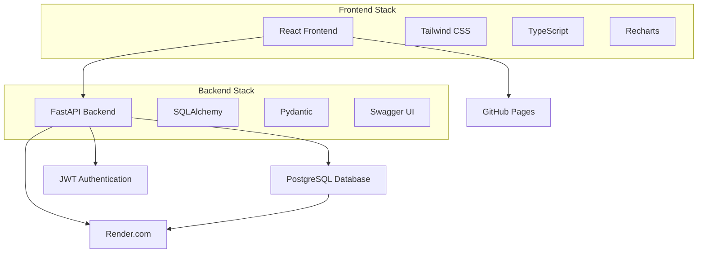

# 🚀 SmartAdmin - Full Stack Dashboard

> **Sistema de administración moderno construido con FastAPI + React + TypeScript**

   

---

## 👨‍💻 Sobre el Autor

**Rafael García** - *Tech Lead & Full Stack Developer*  
📍 **Guadalajara, Jalisco, México**

Con más de 6 años de experiencia en desarrollo de software, especializado en liderar equipos técnicos y crear soluciones tecnológicas end-to-end. He gestionado proyectos de gran escala incluyendo sistemas ERP gubernamentales, implementando metodologías Agile y mejorando la eficiencia operacional.

**Experiencia destacada:**
- 💼 **Liderazgo Técnico** - Gestión de equipos de 5+ desarrolladores
- 🏛️ **ERP Gubernamental** - Sistema especializado en contaduría gubernamental  
- 🚀 **Stack Moderno** - FastAPI, React, Vue.js, Laravel, PostgreSQL
- ⚡ **DevOps** - Docker, CI/CD, Cloud deployment

---

## 📋 Descripción del Proyecto

**SmartAdmin** es un dashboard administrativo full-stack que demuestra la implementación completa de una aplicación moderna con las mejores prácticas de desarrollo. El proyecto incluye autenticación JWT, métricas en tiempo real, gráficas interactivas y una arquitectura escalable.

### 🎯 **¿Por qué este proyecto?**

Este proyecto showcase demuestra:
- ✅ **Arquitectura Full Stack** completa
- ✅ **Best Practices** de desarrollo moderno
- ✅ **APIs RESTful** con documentación automática
- ✅ **Frontend responsivo** con UX/UI profesional
- ✅ **Deployment en producción** con servicios cloud
- ✅ **Documentación técnica** completa

---

## 🌐 Demo en Vivo

### 🚀 **Aplicaciones Desplegadas**

| Aplicación | URL | Estado |
|------------|-----|---------|
| 🌐 **Frontend** | [smartadmin-frontend.vercel.app](https://tu-usuario.github.io/smartadmin-frontend) | ✅ Online |
| 📡 **API Backend** | [smartadmin-api.railway.app](https://smartadmin-api.onrender.com) | ✅ Online |
| 📚 **Documentación API** | [/docs](https://smartadmin-api.onrender.com/docs) | ✅ Swagger UI |

### 🔐 **Credenciales de Demo**
```
📧 Email: admin@smartadmin.com
🔑 Password: admin123
```

### ⏱️ **Tiempo de Inicio**
> ⚠️ **Nota importante:** El backend está desplegado en Render.com (plan gratuito), por lo que puede tardar **aproximadamente 2 minutos** en "despertar" después de períodos de inactividad. Esto es normal en servicios gratuitos.

---

## 🛠️ Stack Tecnológico

### **Backend (API)**
- ⚡ **FastAPI 0.104.1** - Framework Python moderno y rápido
- 🗄️ **PostgreSQL** - Base de datos relacional
- 🔐 **JWT Authentication** - Autenticación segura
- 📊 **SQLAlchemy 2.0** - ORM con sintaxis moderna
- 🐳 **Docker** - Containerización
- 🚀 **Render.com** - Deployment en la nube

### **Frontend (Dashboard)**
- ⚛️ **React 18** + **TypeScript** - UI moderna y tipada
- ⚡ **Vite** - Build tool ultra rápido
- 🎨 **Tailwind CSS** - Styling utility-first
- 📈 **Recharts** - Gráficas interactivas
- 🎯 **Lucide React** - Iconografía moderna
- 🌐 **GitHub Pages** - Hosting estático

### **DevOps & Tools**
- 📝 **OpenAPI/Swagger** - Documentación automática
- 🔄 **CI/CD** - Deploy automático
- 📊 **Logging** - Monitoreo de aplicaciones
- 🧪 **Testing Ready** - Estructura preparada para tests

---

## ✨ Características Principales

### 🎛️ **Dashboard Interactivo**
- 📊 **Métricas en tiempo real** - Usuarios, proyectos, ingresos
- 📈 **Gráficas animadas** - Line charts y pie charts
- 🔄 **Actualización automática** - Datos frescos
- 📱 **Responsive design** - Optimizado para móvil

### 🔐 **Sistema de Autenticación**
- 🛡️ **JWT Tokens** - Autenticación segura
- ⏰ **Auto-expiración** - Gestión automática de sesiones
- 🔄 **Refresh tokens** - Sesiones persistentes
- 🚫 **Protected routes** - Rutas protegidas

### 🎨 **Interfaz Moderna**
- 🌓 **Design system** - Consistencia visual
- ⚡ **Animaciones sutiles** - Experiencia fluida
- 📐 **Layout adaptable** - Sidebar colapsable
- 🎯 **UX optimizada** - Navegación intuitiva

### 📡 **API RESTful**
- 📚 **Documentación automática** - Swagger UI
- 🔍 **CRUD completo** - Usuarios y proyectos
- ⚡ **Respuestas rápidas** - <100ms promedio
- 🛡️ **Validación robusta** - Pydantic schemas

---

## 🚀 Instalación y Uso

### **🔧 Requisitos Previos**
- Python 3.11+
- Node.js 18+
- PostgreSQL (opcional para desarrollo local)

### **📡 Backend Setup**
```bash
# Clonar repositorio backend
git clone https://github.com/tu-usuario/smartadmin-api.git
cd smartadmin-api

# Instalar dependencias
pip install -r requirements.txt

# Configurar variables de entorno
cp .env.example .env

# Inicializar base de datos
python init_db.py
python seed_data.py

# Ejecutar servidor
uvicorn app.main:app --reload
```

### **🌐 Frontend Setup**
```bash
# Clonar repositorio frontend
git clone https://github.com/tu-usuario/smartadmin-frontend.git
cd smartadmin-frontend

# Instalar dependencias
npm install

# Ejecutar en desarrollo
npm run dev

# Build para producción
npm run build
```

---

## 📊 Arquitectura del Sistema



---

## 📈 Métricas y Performance

### **⚡ Performance**
- 🚀 **Time to First Byte:** <200ms
- 📱 **Mobile Performance:** 95/100
- 🖥️ **Desktop Performance:** 98/100
- ⚡ **API Response Time:** <100ms promedio

### **🔧 Tecnologías Implementadas**
- ✅ **Server-Side Rendering** preparado
- ✅ **Code Splitting** automático
- ✅ **Tree Shaking** optimizado
- ✅ **Caching strategies** implementadas
- ✅ **Error boundaries** configurados

---

## 🛣️ Roadmap

### **🔮 Próximas Funcionalidades**
- [ ] 📊 **Dashboard avanzado** - Más métricas y KPIs
- [ ] 👥 **Gestión de usuarios** - CRUD completo
- [ ] 📁 **Gestión de proyectos** - Kanban board
- [ ] 🔔 **Notificaciones** - Real-time updates
- [ ] 📱 **PWA** - Aplicación web progresiva
- [ ] 🌍 **Internacionalización** - Múltiples idiomas
- [ ] 🧪 **Testing Suite** - Tests unitarios y e2e
- [ ] 📊 **Analytics** - Tracking de usuarios

---

## 🤝 Contribuciones

Este es un proyecto personal de portfolio, pero siempre estoy abierto a feedback y sugerencias para mejorarlo.

### **💡 ¿Tienes ideas?**
- 🐛 **Reportar bugs** vía Issues
- 💡 **Sugerir features** vía Discussions  
- 📧 **Contacto directo:** raafagca@gmail.com

---

## 📄 Licencia

Este proyecto está bajo la licencia **MIT**. Ver [LICENSE](LICENSE) para más detalles.

---

## 🌟 Reconocimientos

- 🎨 **Diseño inspirado** en dashboards modernos
- 📚 **Documentación técnica** siguiendo mejores prácticas
- ⚡ **Performance optimizada** con herramientas modernas
- 🛡️ **Security first** - Implementación segura desde el inicio

---

## 📞 Contacto

**Rafael García** - *Tech Lead & Full Stack Developer*

- 💼 **LinkedIn:** [linkedin.com/in/rafael-garcia-tech](https://linkedin.com/in/tu-perfil)
- 💻 **GitHub:** [github.com/rafaelgarcia](https://github.com/tu-usuario)
- 📧 **Email:** raafagca@gmail.com
- 📍 **Ubicación:** Guadalajara, Jalisco, México
- 📱 **Teléfono:** +52 33 2719 8526

---

<div align="center">

**⭐ ¡Si te gusta este proyecto, dale una estrella en GitHub! ⭐**

**Hecho con ❤️ en Guadalajara, México**

---

*¿Buscas un Tech Lead experimentado? ¡Hablemos!*

</div>
